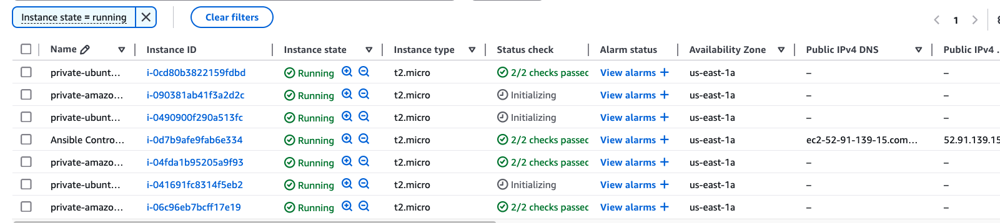
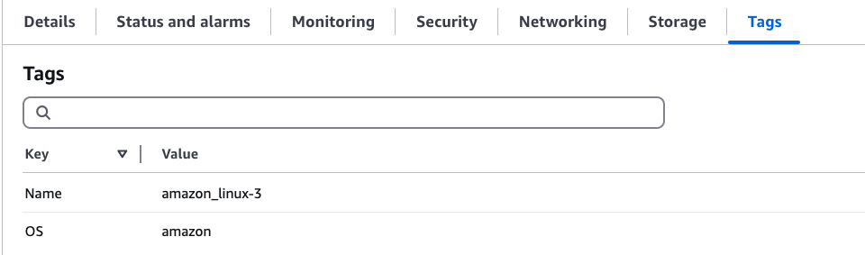
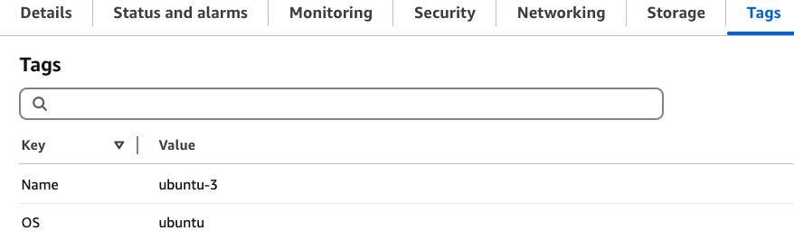
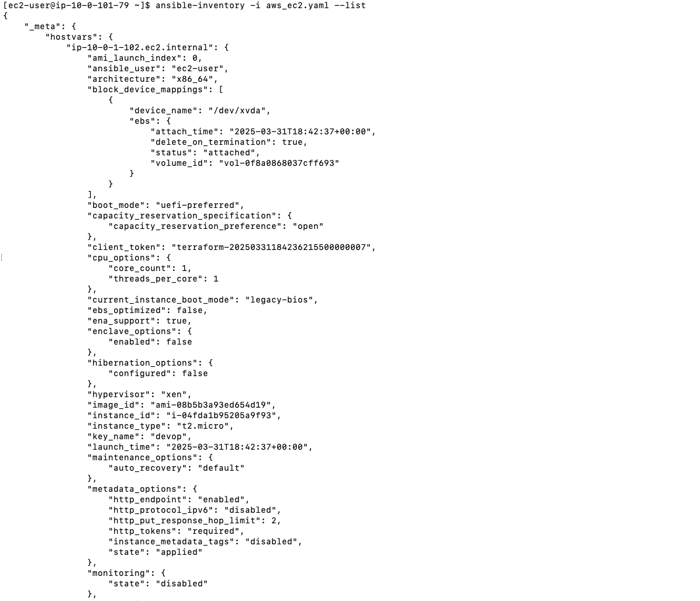
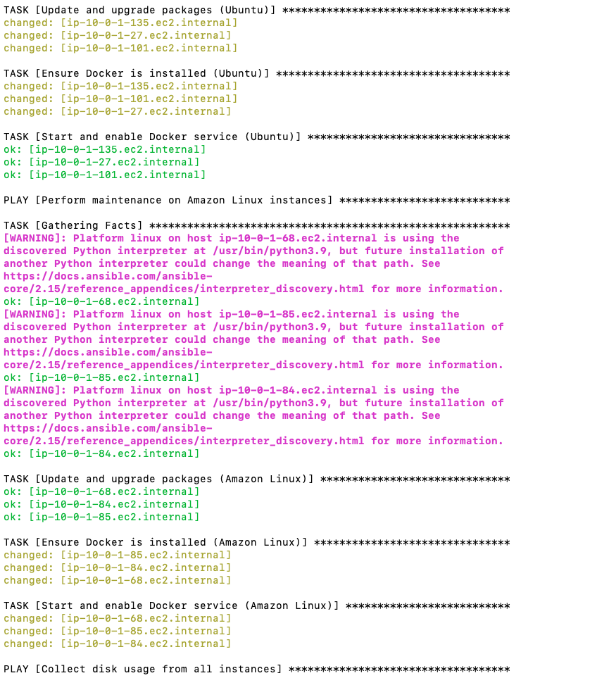
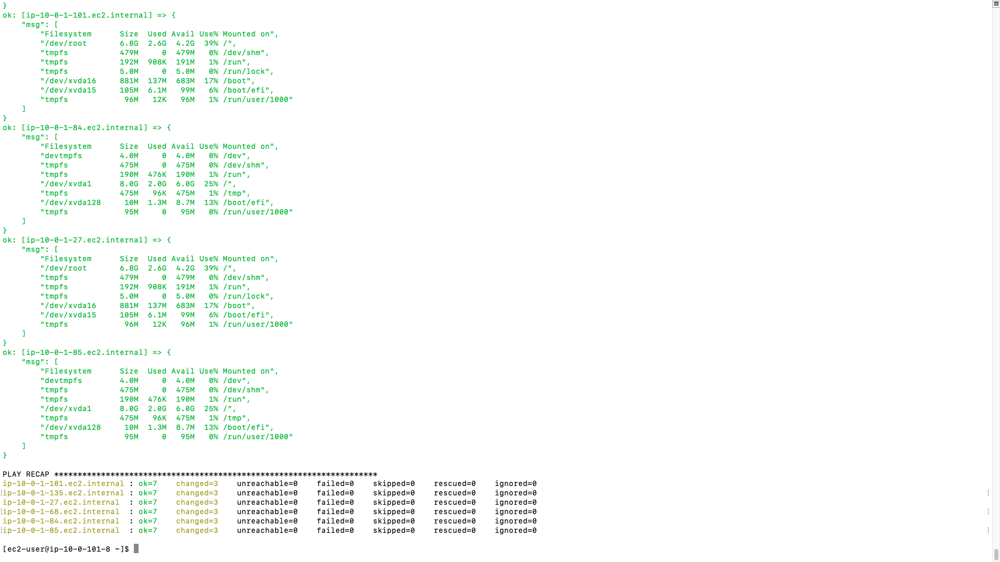
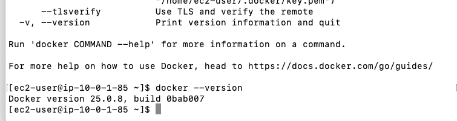

# Terraform and Ansible Automation

## Introduction
This project automates the provisioning of AWS EC2 instances using Terraform and configures them using Ansible. The setup includes:

1. **Terraform** provisions:
   - 6 EC2 instances: 3 Ubuntu and 3 Amazon Linux, tagged accordingly.
   - 1 additional EC2 instance to serve as the Ansible Controller.

2. **Ansible Playbook** targets the 6 EC2 instances to:
   - Update and upgrade packages (if needed).
   - Verify that the latest Docker version is installed.
   - Report disk usage for each EC2 instance.

## Preparation
### Install Required Tools
Ensure you have the following tools installed on your local machine:
- [Packer](https://developer.hashicorp.com/packer/downloads)
- [Terraform](https://developer.hashicorp.com/terraform/downloads)

### AWS Configuration
Configure your AWS credentials by running the following commands:
```sh
aws configure
aws configure set aws_session_token your-token
```

Download the pem file to your repo.

## Usage
### Configure Variables
Before applying the Terraform configuration, update the following variables in your Terraform variable file to match your environment:

1. **`aws_region`**: Set the AWS region where you want to deploy the resources.
   - Example: `"us-east-1"`

2. **`private_ssh_key`**: Specify the name of your SSH key (without the file extension) for SSH access.
   - Example: `"my-key"`

3. **`ip_address`**: Replace this with your current IP address in CIDR notation for secure SSH access.
   - Example: `"70.000.66.125/32"`

### Deploy AWS Resources with Terraform
Execute the following commands to provision the AWS infrastructure:
```sh
terraform init
terraform plan
terraform apply
```
  




### Access to Ansible Controller
Configure SSH Access
To connect to the Ansible Controller instance, follow these steps:

```sh
chmod 600 devop.pem
ssh-add devop.pem
ssh -A -i devop.pem ec2-user@your ip
```

Copy the necessary Ansible configuration files to the Ansible Controller instance:
```sh
scp playbook.yaml ec2-user@your ip:~
scp aws_ec2.yaml ec2-user@your ip:~
```

### Configure Instances with Ansible
After Terraform completes provisioning, use Ansible to configure the instances:
```sh
ansible-inventory -i aws_ec2.yaml --list
```
 

To prevent SSH host key verification issues when connecting to dynamically created EC2 instances, use these extra arguments.
```sh
ansible-playbook -i aws_ec2.yaml playbook.yaml -e 'ansible_ssh_common_args="-o StrictHostKeyChecking=no -o UserKnownHostsFile=/dev/null"'
```


### Expected Results
- Disk usage should be reported for each instance.

  


- The private instance has installed the docker.


